# Tradyxa RubiX

> **AI-Powered Market Intelligence Dashboard for NIFTY & BANKNIFTY**

[](https://tradyxa-rubix.pages.dev)
[](LICENSE)
[](https://python.org)
[](https://react.dev)

---

## 🎯 What is Tradyxa RubiX?

Tradyxa RubiX is a **free, AI-powered trading analytics dashboard** that provides actionable insights for NIFTY and BANKNIFTY traders. It combines 5 Machine Learning models with statistical analysis to generate **19 dynamic tiles** with plain-English verdicts.

**Key Features:**
- 🤖 5 ML Models trained on 3000+ days of historical data
- 📊 19 Real-time tiles updated every inference run
- 🎯 Plain-English verdicts for beginners
- 📈 Monte Carlo simulations with 10,000 price paths
- 🔄 Automated daily updates via GitHub Actions

---

## 📐 System Architecture

```mermaid
flowchart TB
    subgraph DATA["📦 Data Layer"]
        YF[("Yahoo Finance API")]
        CSV[(Cached CSV Files)]
    end
    
    subgraph ML["🤖 ML Engine (Python)"]
        DF[data_fetcher.py]
        FB[feature_builder.py]
        
        subgraph MODELS["Trained Models"]
            HMM[HMM Regime Detector]
            RF[RF Streak Reversal]
            XGB[XGBoost Momentum]
            QR[Quantile Regression]
            GBM[GBM Divergence]
        end
        
        STATS[Statistical Formulas]
        INFER[infer.py]
    end
    
    subgraph OUTPUT["📤 Output"]
        JSON[(rubix_nifty.json<br>rubix_banknifty.json)]
    end
    
    subgraph FRONTEND["🖥️ Frontend (React)"]
        APP[App.tsx]
        TILES[19 Dashboard Tiles]
        VERDICT[Overall Verdict]
    end
    
    YF --> DF
    DF --> CSV
    CSV --> FB
    FB --> MODELS
    MODELS --> INFER
    STATS --> INFER
    INFER --> JSON
    JSON --> APP
    APP --> TILES
    APP --> VERDICT
```



---

## 🛠️ Tech Stack

### Frontend
| Technology | Purpose |
|------------|---------|
| **React 19** | UI Framework with Hooks |
| **TypeScript** | Type-safe JavaScript |
| **Tailwind CSS** | Utility-first styling |
| **Framer Motion** | Animations |
| **Recharts** | Chart visualizations |
| **Lucide Icons** | Icon library |

### Backend (ML Engine)
| Technology | Purpose |
|------------|---------|
| **Python 3.12** | ML & Data Processing |
| **yfinance** | Market data fetching |
| **pandas** | Data manipulation |
| **numpy** | Numerical computing |
| **scikit-learn** | RandomForest, QuantileRegression |
| **xgboost** | Gradient Boosting |
| **hmmlearn** | Hidden Markov Models |
| **scipy** | Statistical functions |
| **joblib** | Model serialization |

### DevOps
| Technology | Purpose |
|------------|---------|
| **GitHub Actions** | CI/CD automation |
| **Cloudflare Pages** | Frontend hosting |
| **Cron Schedules** | Automated training/inference |

---

## 📁 Project Structure

```
Tradyxa-Rubix/
├── 📂 engine/                    # Python ML Backend
│   ├── 📂 scripts/               # All Python scripts
│   │   ├── data_fetcher.py       # yfinance data ingestion
│   │   ├── feature_builder.py    # 68 technical features
│   │   ├── hmm_regime.py         # HMM Regime Detector
│   │   ├── rf_reversal.py        # RF Streak Reversal
│   │   ├── xgb_momentum.py       # XGBoost Momentum
│   │   ├── qr_range.py           # Quantile Regression Range
│   │   ├── gbm_divergence.py     # GBM Divergence Detector
│   │   ├── probability_models.py # Monte Carlo, barriers
│   │   ├── risk_calculator.py    # VaR, Kelly, CVaR
│   │   ├── friday_fear.py        # Weekend gap analysis
│   │   ├── train_all_models.py   # Weekly training orchestrator
│   │   └── infer.py              # Daily inference → JSON
│   ├── 📂 data/                  # Cached market data CSVs
│   ├── 📂 models/                # Trained .pkl files
│   └── requirements.txt          # Python dependencies
│
├── 📂 public/
│   └── 📂 data/
│       ├── rubix_nifty.json      # NIFTY inference output
│       └── rubix_banknifty.json  # BANKNIFTY inference output
│
├── 📂 components/                # React UI components
├── 📂 services/                  # Data fetching services
├── 📂 .github/workflows/         # GitHub Actions
│   ├── weekly_training.yml       # Saturday model training
│   └── daily_inference.yml       # Hourly inference updates
│
├── App.tsx                       # Main React component
├── types.ts                      # TypeScript interfaces
├── index.html                    # Entry point with meta tags
└── README.md                     # This file
```

---

## 🤖 Machine Learning Models

### Overview

```mermaid
flowchart LR
    subgraph INPUT["Raw Data"]
        OHLCV[OHLCV Prices]
        VIX[India VIX]
    end
    
    subgraph FEATURES["68 Features"]
        RSI[RSI 14]
        MACD[MACD]
        BB[Bollinger Bands]
        ATR[ATR 14]
        SMA[SMA 20/50/200]
        VOL[Volatility]
        STREAK[Streak Days]
    end
    
    subgraph MODELS["5 ML Models"]
        M1["🔴 HMM Regime"]
        M2["🟢 RF Reversal"]
        M3["🔵 XGB Momentum"]
        M4["🟡 QR Range"]
        M5["🟣 GBM Divergence"]
    end
    
    INPUT --> FEATURES
    FEATURES --> MODELS
```



---

### Model 1: HMM Regime Detector

**File:** `engine/scripts/hmm_regime.py`

**Purpose:** Identifies the current market regime (TRENDING, MEAN_REVERTING, or CHAOTIC)

**Algorithm:** Gaussian Hidden Markov Model with 3 hidden states

**How It Works:**


**Training Data:** 
- Source: yfinance `^NSEI` (NIFTY 50)
- Period: 2005-01-01 to present
- Features: Daily log returns

**State Labeling (Fix #6):**
States are sorted by volatility to ensure consistent labeling:
- Lowest volatility → TRENDING
- Medium volatility → MEAN_REVERTING  
- Highest volatility → CHAOTIC

**Dashboard Tile:** `Market Regime`

---

### Model 2: Random Forest Streak Reversal

**File:** `engine/scripts/rf_reversal.py`

**Purpose:** Predicts probability of trend reversal after winning/losing streaks

**Algorithm:** Random Forest Classifier (100 trees)

**Features Used:**
| Feature | Description |
|---------|-------------|
| `streak_length` | Consecutive up/down days |
| `streak_return` | Cumulative return during streak |
| `rsi_14` | Relative Strength Index |
| `bb_position` | Position within Bollinger Bands |
| `volume_ratio` | Volume vs 20-day average |

**How It Works:**


**Streak Confidence Penalty (Fix #5):**
```python
if streak > 5:
    penalty = 0.85 ** (streak - 5)
    probability *= penalty
```

**Dashboard Tile:** `Reversal Chance`

---

### Model 3: XGBoost Momentum Pulse

**File:** `engine/scripts/xgb_momentum.py`

**Purpose:** Scores momentum strength from 0-100

**Algorithm:** XGBoost Classifier with gradient boosting

**Features Used (15 total):**
```python
['return_1d', 'return_5d', 'return_10d', 'return_20d',
 'volatility_20d', 'rsi_14', 'macd', 'macd_signal', 'macd_hist',
 'bb_position', 'atr_14', 'sma_ratio_20_50', 'vix', 
 'volume_ratio', 'streak']
```

**Score Interpretation:**
| Score | Verdict |
|-------|---------|
| > 70 | STRONG MOMENTUM - Trend continuation likely |
| 50-70 | MODERATE - Be selective |
| < 50 | WEAK/RANGE-BOUND - Avoid trend trades |

**Dashboard Tile:** `Momentum`

---

### Model 4: Quantile Regression Range Predictor

**File:** `engine/scripts/qr_range.py`

**Purpose:** Predicts expected price range with confidence intervals

**Algorithm:** Gradient Boosting Regressor with quantile loss

**Quantiles Predicted:**
- Q10 (10th percentile) → Lower bound
- Q50 (50th percentile) → Median
- Q90 (90th percentile) → Upper bound

**Skewness Adjustment (Fix #9):**


**Dashboard Tile:** `Expected Range`

---

### Model 5: GBM Divergence Detector

**File:** `engine/scripts/gbm_divergence.py`

**Purpose:** Detects price-indicator divergences (bullish/bearish)

**Algorithm:** Gradient Boosting Machine Classifier

**Divergence Types:**
| Type | Condition |
|------|-----------|
| **Bullish** | Price making lower lows, RSI making higher lows |
| **Bearish** | Price making higher highs, RSI making lower highs |
| **None** | No divergence detected |

**Dashboard Tiles:** `hero.verdictTitle` (BULLISH EDGE / BEARISH DIVERGENCE)

---

## 📊 Tile-to-Model Mapping


---

## 🔄 Data Flow Pipeline

### Weekly Training Flow


### Daily Inference Flow


---

## 📊 Feature Engineering

### 68 Technical Features

**File:** `engine/scripts/feature_builder.py`


**Feature Leakage Prevention (Fix #1):**
```python
# Labels use future data (shift -1)
df['target'] = (df['Close'].shift(-1) > df['Close']).astype(int)

# Features use only past data (no shift or positive shift)
df['return_1d'] = df['Close'].pct_change(1)  # Uses yesterday
```

---

## 📈 Statistical Formulas

### Value at Risk (VaR)

```python
def calculate_var_cvar(returns, confidence=0.95):
    """Historical VaR at 95% confidence."""
    var = np.percentile(returns, (1 - confidence) * 100)
    cvar = returns[returns <= var].mean()
    return {'var_95': var, 'cvar_95': cvar}
```

### Kelly Criterion (Regime-Adjusted)

```python
def kelly_regime_adjusted(win_rate, regime, avg_win, avg_loss):
    """
    Kelly = (p * b - q) / b
    Where: p = win_rate, q = 1-p, b = avg_win/avg_loss
    """
    b = avg_win / abs(avg_loss) if avg_loss != 0 else 1
    kelly = (win_rate * b - (1 - win_rate)) / b
    
    # Regime adjustment (Fix #4)
    if regime == 'CHAOTIC':
        kelly *= 0.5  # Halve in chaotic markets
    elif regime == 'MEAN_REVERTING':
        kelly *= 0.8  # Reduce in ranging markets
    
    return max(0, min(kelly, 0.25))  # Cap at 25%
```

### Hurst Exponent

```python
def calculate_hurst_exponent(prices, max_lag=100):
    """
    H > 0.5: Trending (momentum works)
    H < 0.5: Mean-reverting (contrarian works)
    H = 0.5: Random walk
    """
    lags = range(2, min(max_lag, len(prices) // 2))
    tau = [np.std(np.subtract(prices[lag:], prices[:-lag])) for lag in lags]
    hurst = np.polyfit(np.log(lags), np.log(tau), 1)[0]
    return hurst / 2
```

### Monte Carlo Simulation

```python
def monte_carlo_cones(spot, volatility, T_days=5, n_sims=10000):
    """Merton Jump-Diffusion Monte Carlo."""
    dt = 1/252
    paths = np.zeros((n_sims, T_days))
    paths[:, 0] = spot
    
    for t in range(1, T_days):
        z = np.random.standard_normal(n_sims)
        jump = np.random.poisson(jump_lambda * dt, n_sims)
        paths[:, t] = paths[:, t-1] * np.exp(
            (mu - 0.5 * volatility**2) * dt +
            volatility * np.sqrt(dt) * z +
            jump * jump_mean
        )
    
    return {
        '1sigma_low': np.percentile(paths[:, -1], 16),
        'median': np.median(paths[:, -1]),
        '1sigma_high': np.percentile(paths[:, -1], 84)
    }
```

---

## 🚀 Getting Started

### Prerequisites

- Python 3.12+
- Node.js 18+
- Git

### Installation

```bash
# Clone the repository
git clone https://github.com/pravindev666/ZetaX.git
cd ZetaX

# Install Python dependencies
cd engine
pip install -r requirements.txt

# Train models (first time only)
python scripts/train_all_models.py

# Run inference
python scripts/infer.py

# Start frontend (in root directory)
cd ..
npm install
npm run dev
```

### Running Locally

```bash
# Terminal 1: Run inference
cd engine
python scripts/infer.py

# Terminal 2: Start dev server
npm run dev
# Opens http://localhost:5173
```

---

## 🔧 GitHub Actions

### Weekly Training (`weekly_training.yml`)

```yaml
schedule:
  - cron: '0 0 * * 6'  # Saturday 00:00 UTC
```

**Steps:**
1. Fetch latest NIFTY/BANKNIFTY/VIX data
2. Train all 5 ML models
3. Commit updated `.pkl` files

### Daily Inference (`daily_inference.yml`)

```yaml
schedule:
  - cron: '*/30 4-10 * * 1-5'  # Every 30 min, M-F, 9:30-16:00 IST
```

**Steps:**
1. Fetch live prices
2. Run inference pipeline
3. Generate `rubix_nifty.json` and `rubix_banknifty.json`
4. Commit and deploy

---

## 📜 Legal & Compliance

### SEBI Compliance Statement

> ⚠️ **IMPORTANT DISCLAIMER**
>
> Tradyxa RubiX is an **educational analytics tool** and does not provide financial advice. All predictions are probabilistic estimates based on historical data.
>
> - Past performance does not guarantee future results
> - Trade at your own risk
> - We are not SEBI registered investment advisors
> - This is NOT a recommendation to buy/sell securities

### Data Sources

| Source | Usage | License |
|--------|-------|---------|
| Yahoo Finance | OHLCV, VIX data | Fair Use |
| NSE India | Reference only | Public Data |

---

## 👥 Credits

**Developed by:** Zeta Aztra Technologies (India)

**Contact:** zetaaztratech@gmail.com

**Jurisdiction:** Chennai, Tamil Nadu, India

---

## 📄 License

Copyright © 2025 Zeta Aztra Technologies. All Rights Reserved.

This software is proprietary. Unauthorized copying, modification, or distribution is prohibited.

---

<div align="center">
  
  <h3>Tradyxa RubiX</h3>
  <p><em>AI-Powered Market Intelligence</em></p>
</div>
